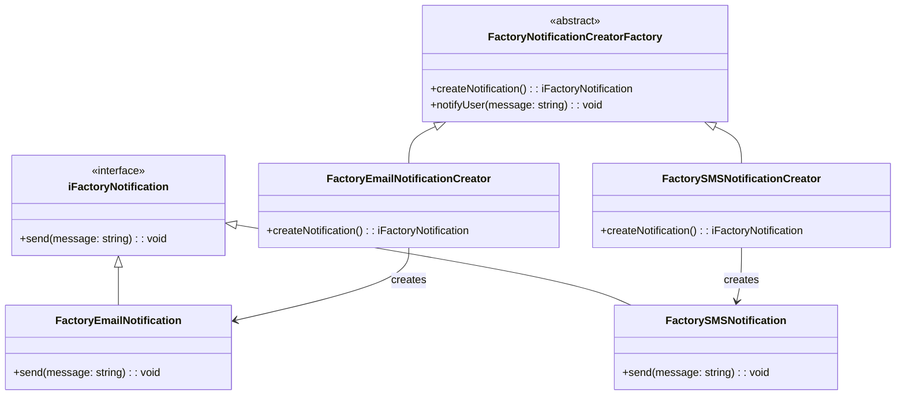
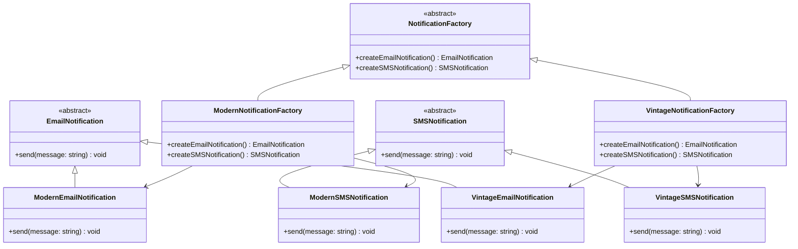
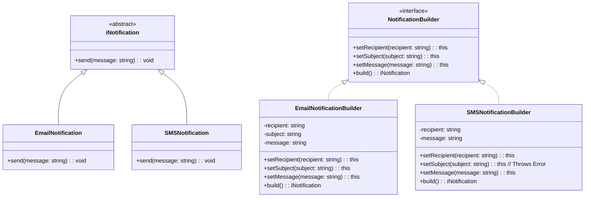
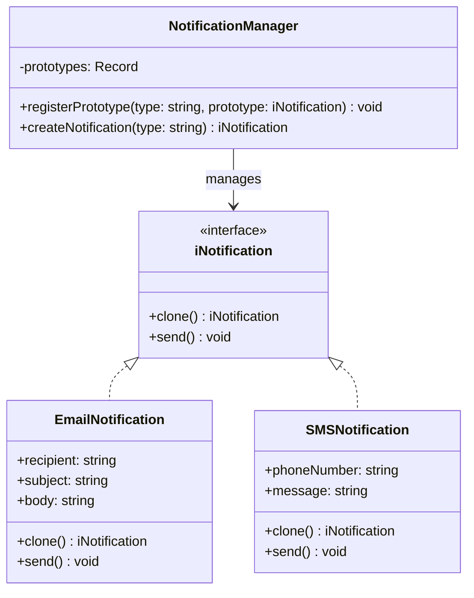
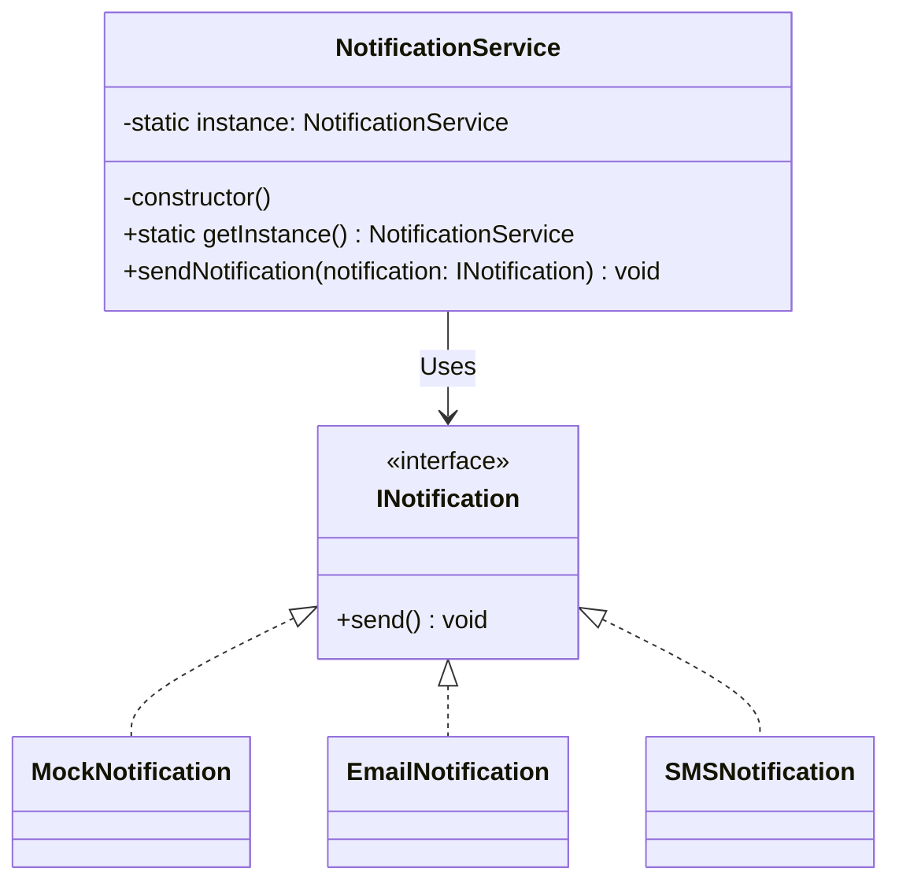

# My Design Patterns Notes

> [!IMPORTANT]
> My personal notes and deep dive on the following [Design Patterns](https://refactoring.guru/design-patterns/catalog)

#### Clone & Install

```bash
git clone git@github.com:monty-src/design-patterns.git
cd design-patterns && npm i --verbose
npm test
```

## Table of Contents


### Creational Patterns

- :factory: [Factory Method](./src/factory-method/README.md): is a design pattern that simplifies object creation by providing a centralized place to instantiate different types of objects, making your code more flexible and easier to manage.
- :factory: [Abstract Factory](./src/abstract-factory/README.md): is a design pattern that provides an interface for creating families of related or dependent objects without specifying their concrete classes.
- :house: [Builder](./src/builder/README.md): is a design pattern that separates the construction of a complex object from its representation, allowing the same construction process to create different representations.
- :repeat_one: [Prototype](./src/prototype/README.md): is a design pattern that allows you to create new objects by cloning existing ones, rather than instantiating new objects from scratch.
- :lock: [Singleton](./src/singleton/README.md): is a design pattern that ensures a class has only one instance and provides a global point of access to it.


> [!NOTE]
> [All Diagrams](./diagrams.md)


## [Factory Method](./src/factory-method/README.md)

#### File Structure

```bash
📦 src/factory-method
 ┣ 📜 factory-method.ts
 ┣ 📜 README.md
📦 test/factory-method
 ┣ 📜 factoryMethod.test.ts
 ┣ 📜 factoryNotification.test.ts
```

#### Test

```bash
npm run test:factory-method
```



## [Abstract Factory](./src/abstract-factory/README.md)

#### File Structure

```bash
📦 src/abstract-factory
 ┣ 📜 abstract-factory.ts
 ┣ 📜 README.md
📦 test/abstract-factory
 ┣ 📜 abstractFactory.test.ts
```

#### Test

```bash
npm run test:abstract-factory
```



## [Builder](./src/builder/README.md)

#### File Structure

```bash
📦 src/builder
 ┣ 📜 builder.ts
 ┣ 📜 README.md
📦 test/builder
 ┣ 📜 builder.test.ts
```

#### Test

```bash
npm run test:builder
```



## [Prototype](./src/prototype/README.md)

#### File Structure

```bash
📦 src/prototype
 ┣ 📜 prototype.ts
 ┣ 📜 README.md
📦 test/prototype
 ┣ 📜 prototype.test.ts
```

#### Test

```bash
npm run test:prototype
```



## [Singleton](./src/singleton/README.md)

#### File Structure

```bash
📦 src/singleton
 ┣ 📜 singleton.ts
 ┣ 📜 README.md
📦 test/singleton
 ┣ 📜 singleton.test.ts
```

#### Test

```bash
npm run test:singleton
```

