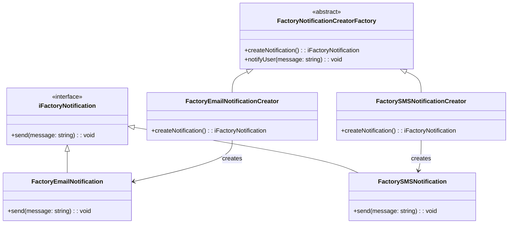

# My Design Patterns Notes

> [!IMPORTANT]
> My personal notes and deep dive on the following [Design Patterns](https://refactoring.guru/design-patterns/catalog)

#### Clone & Install

```bash
git clone git@github.com:monty-src/design-patterns.git
cd design-patterns && npm i --verbose
```

## Table of Contents


### Creational Patterns

- :factory: [Factory Method](./src/factory-method/README.md): is a design pattern that simplifies object creation by providing a centralized place to instantiate different types of objects, making your code more flexible and easier to manage.

---

[All diagrams](./diagrams.md)


## [Factory Method](./src/factory-method/README.md)

#### File Structure

```bash
📦 src/factory-method
 ┣ 📜 factory-method.ts
 ┣ 📜 README.md
📦 test/factory-method
 ┣ 📜 factoryMethod.test.ts
 ┣ 📜 factoryNotification.test.ts
```

#### Test

```bash
npm run test:factory-method
```

