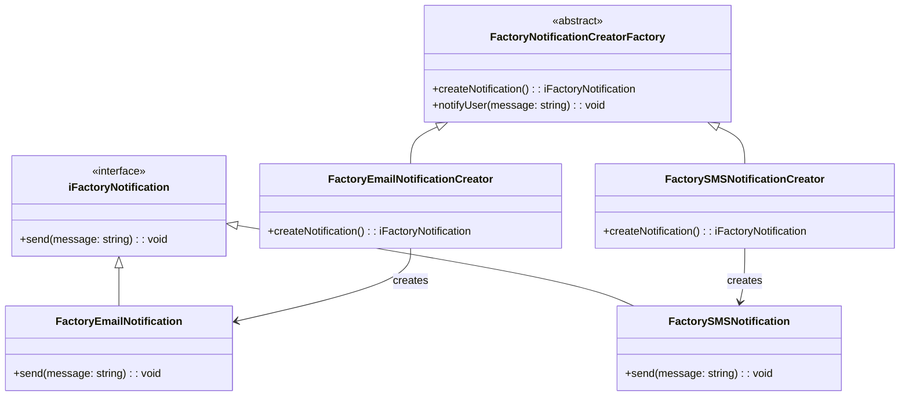

# My Design Patterns Notes

## [Factory Method](./src/factory-method/README.md)

```bash
📦 src/factory-method
 ┣ 📜 factory-method.ts
 ┣ 📜 README.md
📦 test/factory-method
 ┣ 📜 factoryMethod.test.ts
 ┣ 📜 factoryNotification.test.ts
```

```bash
npm i --verbose
npx mocha --fgrep 'Factory Method Test'
```

