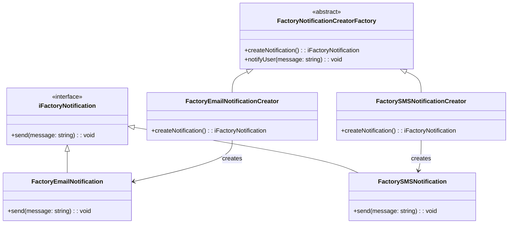

# Diagrams

## Table of Contents

### Creational Patterns

- :factory: [Factory Method](#factory-method): is a design pattern that simplifies object creation by providing a centralized place to instantiate different types of objects, making your code more flexible and easier to manage.

## Creational Patterns

### [Factory Method](./src/factory-method/README.md)

