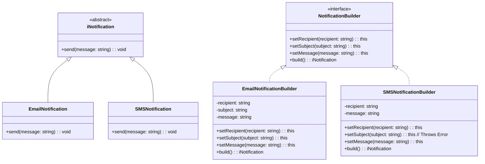
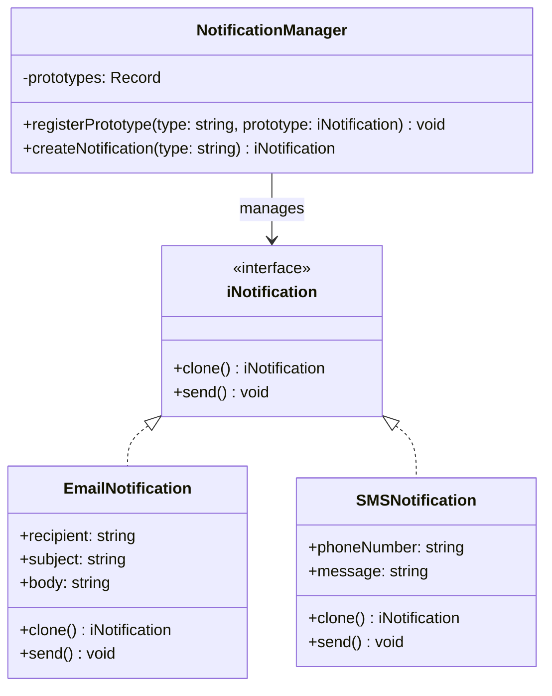

# Diagrams

## Table of Contents

### Creational Patterns

- :factory: [Factory Method](#factory-method): is a design pattern that simplifies object creation by providing a centralized place to instantiate different types of objects, making your code more flexible and easier to manage.
- :factory: [Abstract Factory](#abstract-factory): is a design pattern that provides an interface for creating families of related or dependent objects without specifying their concrete classes.
- :house: [Builder](./src/builder/README.md): is a design pattern that separates the construction of a complex object from its representation, allowing the same construction process to create different representations.
- :repeat_one: [Prototype](./src/prototype/README.md): is a design pattern that allows you to create new objects by cloning existing ones, rather than instantiating new objects from scratch.

## Creational Patterns

### [Factory Method](./src/factory-method/README.md)

### [Abstract Factory](./src/abstract-factory/README.md)

### [Builder](./src/builder/README.md)

### [Prototype](./src/prototype/README.md)

