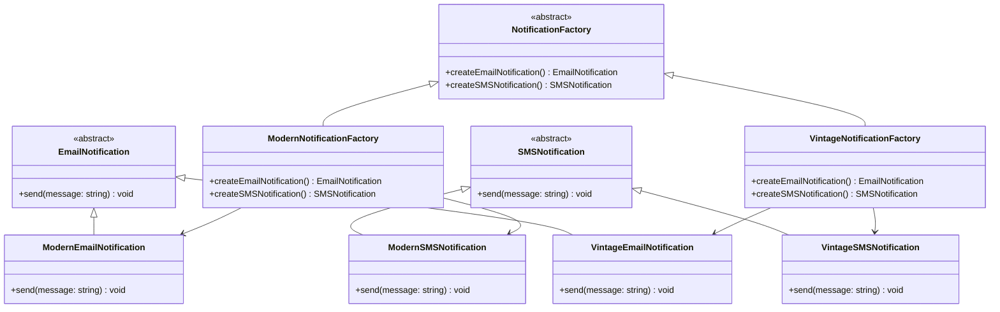

# Abstract Factory

#### File Structure

```bash
📦 src/abstract-factory
 ┣ 📜 abstract-factory.ts
 ┣ 📜 README.md
📦 test/abstract-method
 ┣ 📜 abstractFactory.test.ts
```

#### Test

```bash
npm run test:abstract-factory
```

## Breakdown

### Key Points

- :white_check_mark: **Creates families of related objects** without specifying their concrete classes.
- :white_check_mark: **Encapsulates object creation logic**, keeping it separate from business logic.
- :white_check_mark: **Ensures compatibility** by producing objects that work well together.
- :white_check_mark: **Improves flexibility**, allowing new variations without modifying existing code.
- :white_check_mark: **Prevents code duplication** by centralizing instantiation in a single factory.
- :white_check_mark: **Real-world analogy:** A restaurant kitchen—customers order meals without needing to - know who the chef is or how the food is prepared.

## Benefits

- :white_check_mark: **Isolation:** The client code works with the abstract factory and concrete factories without knowing the specific classes of the products.
- :white_check_mark: **Flexibility:** The client code can work with any concrete factory implementation.
- :white_check_mark: **Reusability:** The abstract factory can be used to create different types of products.
- :white_check_mark: **Testability:** The abstract factory can be tested independently of the client code.

## Drawbacks

- **Increased Complexity** – This pattern introduces multiple factory classes and abstract interfaces, which can make the codebase more complex and harder to navigate.
- **Difficult to Modify or Extend** – Adding new product types requires modifying the factory interface and all concrete factory implementations, which can lead to a ripple effect across the code.
- **Potential Code Duplication** – Since each factory must implement the creation of specific product families, there could be repeated logic across different factory implementations.
- **Rigid Structure** – If the product variations are not well-defined in advance, this pattern can be too restrictive and require frequent changes when new types of products need to be introduced.
- **Increased Maintenance Effort** – More classes and interfaces mean more files to maintain, which could slow down development, especially for small-scale projects where a simpler approach would suffice.
- **Not Always Necessary** – In cases where only a few objects need to be created, using an abstract factory may be overkill compared to simpler approaches like factory methods or direct instantiation.


## Example

### Class Architecture


### Code - Snippet

```ts
/**
 * Abstract class for email notifications.
 * 
 * @abstract
 * @class
 */
abstract class EmailNotification {
  abstract send(message: string): void;
}

/**
 * Abstract class for SMS notifications.
 * 
 * @abstract
 * @class
 */
abstract class SMSNotification {
  /**
   * Sends a message.
   * 
   * @param message - The message to send.
   */
  abstract send(message: string): void;
}

/**
 * Abstract factory for creating notifications.
 * 
 * @abstract
 * @class
 */
abstract class NotificationFactory {
  /**
   * Creates an email notification.
   * 
   * @returns {EmailNotification} - The created email notification.
   */
  abstract createEmailNotification(): EmailNotification;

  /**
   * Creates an SMS notification.
   * 
   * @returns {SMSNotification} - The created SMS notification.
   */
  abstract createSMSNotification(): SMSNotification;
}

/**
 * Modern email notification.
 * 
 * @class
 */
class ModernEmailNotification extends EmailNotification {
  send(message: string): void {
    console.log(`Sending MODERN EMAIL notification: ${message}`);
  }
}

/**
 * Modern SMS notification.
 * 
 * @class
 */
class ModernSMSNotification extends SMSNotification {
  send(message: string): void {
    console.log(`Sending MODERN SMS notification: ${message}`);
  }
}

/**
 * Modern notification factory.
 * 
 * @class
 */
class ModernNotificationFactory extends NotificationFactory {
  /**
   * Creates a modern email notification.
   * 
   * @returns {EmailNotification} - The created email notification.
   */
  createEmailNotification(): EmailNotification {
    return new ModernEmailNotification();
  }

  /**
   * Creates a modern SMS notification.
   * 
   * @returns {SMSNotification} - The created SMS notification.
   */
  createSMSNotification(): SMSNotification {
    return new ModernSMSNotification();
  }
}

/**
 * Vintage email notification.
 * 
 * @class
 */
class VintageEmailNotification extends EmailNotification {
  /**
   * Sends a message.
   * 
   * @param message - The message to send.
   */
  send(message: string): void {
    console.log(`Sending VINTAGE EMAIL notification: ${message}`);
  }
}

/**
 * Vintage SMS notification.
 * 
 * @class
 */
class VintageSMSNotification extends SMSNotification {
  /**
   * Sends a message.
   * 
   * @param message - The message to send.
   */
  send(message: string): void {
    console.log(`Sending VINTAGE SMS notification: ${message}`);
  }
}

/**
 * Vintage notification factory.
 * 
 * @class
 */
class VintageNotificationFactory extends NotificationFactory {
  /**
   * Creates a vintage email notification.
   * 
   * @returns {EmailNotification} - The created email notification.
   */
  createEmailNotification(): EmailNotification {
    return new VintageEmailNotification();
  }

  /**
   * Creates a vintage SMS notification.
   * 
   * @returns {SMSNotification} - The created SMS notification.
   */
  createSMSNotification(): SMSNotification {
    return new VintageSMSNotification();
  }
}

(() => {
  // Create modern notification factory
  const modernFactory = new ModernNotificationFactory();
  const modernEmail = modernFactory.createEmailNotification();
  modernEmail.send("Your order has been shipped!");

  const modernSMS = modernFactory.createSMSNotification();
  modernSMS.send("Your package will be delivered today.");

  // Create vintage notification factory
  const vintageFactory = new VintageNotificationFactory();
  const vintageEmail = vintageFactory.createEmailNotification();
  vintageEmail.send("Your order has been shipped!");

  const vintageSMS = vintageFactory.createSMSNotification();
  vintageSMS.send("Your package will be delivered today.");
})();
```