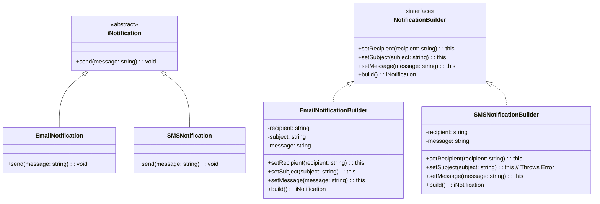

# Builder

#### File Structure

```bash
📦 src/builder
 ┣ 📜 builder.ts
 ┣ 📜 README.md
📦 test/builder
 ┣ 📜 builder.test.ts
```

#### Test

```bash
npm run test:builder
```

## Breakdown

### Key Points

- :white_check_mark: **Flexibility** – Allows objects to be built in various configurations without modifying the underlying code.
- :white_check_mark: **Separation of Concerns** – Keeps object creation separate from its actual use, making the codebase cleaner and more maintainable.
- :white_check_mark: **Client Control** – Gives the client precise control over how an object is constructed by interacting with a builder.
- :white_check_mark: **Structured Construction** – Ensures that complex objects are built in an organized and predictable manner.

## Benefits

- :white_check_mark: **Improves Readability & Maintainability** – By separating object creation from its representation, the code becomes easier to manage.
- :white_check_mark: **Encapsulates Object Construction Logic** – Prevents long, unreadable constructor calls by providing a more intuitive way to create objects.
- :white_check_mark: **Supports Multiple Configurations** – A single builder can construct different variations of an object without code duplication.
- :white_check_mark: **Ensures Consistency** – Helps prevent partially constructed or invalid objects by enforcing a step-by-step process.

## Drawbacks

- :no_entry_sign: **Increased Complexity** – More classes & interfaces make the code harder to maintain.
- :no_entry_sign: **Verbose Code** – Requires multiple setters and a build() method.
- :no_entry_sign: **Performance Overhead** – Extra method calls slow down object creation.
- :no_entry_sign: **Not Ideal for Simple Objects** – Overkill when a constructor suffices.
- :no_entry_sign: **Code Duplication** – Multiple builders may repeat logic.
- :no_entry_sign: **Harder Debugging** – Errors from missing fields appear at runtime.
- :no_entry_sign: **Dependency on Builder** – Client code tightly couples to the builder.
- :no_entry_sign: **Breaks Encapsulation** – Builder accesses all internal fields.

## Example

### Class Architecture



### Code - Snippet

```ts
/**
 * Abstract class for notifications.
 *
 * @abstract
 * @class
 */
abstract class iNotification {
  /**
   * Sends a message.
   *
   * @abstract
   * @param {string} message
   * @returns {void}
   */
  abstract send(message: string): void;
}

/**
 * Concrete class for email notifications.
 *
 * @class
 * @extends {iNotification}
 */
class EmailNotification extends iNotification {
  /**
   * Sends an email notification.
   *
   * @param {string} message
   * @returns {void}
   */
  send(message: string): void {
    console.log(`Sending Email Notification: ${message}`);
  }
}

/**
 * Concrete class for SMS notifications.
 *
 * @class
 * @extends {iNotification}
 */
class SMSNotification extends iNotification {
  send(message: string): void {
    console.log(`Sending SMS Notification: ${message}`);
  }
}

/**
 * Interface for notification builders.
 *
 * @interface
 */
interface NotificationBuilder {
  /**
   * Sets the recipient.
   *
   * @param {string} recipient
   * @returns {this}
   */
  setRecipient(recipient: string): this;
  /**
   * Sets the subject.
   *
   * @param {string} subject
   * @returns {this}
   */
  setSubject(subject: string): this;
  /**
   * Sets the message.
   *
   * @param {string} message
   * @returns {this}
   */
  setMessage(message: string): this;
  /**
   * Builds a notification.
   *
   * @returns {iNotification}
   */
  build(): iNotification;
}

/**
 * Concrete builder for email notifications.
 *
 * @class
 * @implements {NotificationBuilder}
 */
class EmailNotificationBuilder implements NotificationBuilder {
  /**
   * The recipient.
   *
   * @type {string}
   */
  private recipient: string = "";
  /**
   * The subject.
   *
   * @type {string}
   */
  private subject: string = "";
  /**
   * The message.
   *
   * @type {string}
   */
  private message: string = "";

  /**
   * Sets the recipient.
   *
   * @param {string} recipient
   * @returns {this}
   */
  setRecipient(recipient: string): this {
    this.recipient = recipient;
    return this;
  }

  /**
   * Sets the subject.
   *
   * @param {string} subject
   * @returns {this}
   */
  setSubject(subject: string): this {
    this.subject = subject;
    return this;
  }

  /**
   * Sets the message.
   *
   * @param {string} message
   * @returns {this}
   */
  setMessage(message: string): this {
    this.message = message;
    return this;
  }

  /**
   * Builds a notification.
   *
   * @returns {iNotification}
   */
  build(): iNotification {
    const email = new EmailNotification();
    console.log(`Building Email Notification to ${this.recipient}`);
    return email;
  }
}

/**
 * Concrete builder for SMS notifications.
 *
 * @class
 * @implements {NotificationBuilder}
 */
class SMSNotificationBuilder implements NotificationBuilder {
  /**
   * The recipient.
   *
   * @type {string}
   */
  private recipient: string = "";
  /**
   * The message.
   *
   * @type {string}
   */
  private message: string = "";

  /**
   * Sets the recipient.
   *
   * @param {string} recipient
   * @returns {this}
   */

  setRecipient(recipient: string): this {
    this.recipient = recipient;
    return this;
  }

  /**
   * Sets the subject.
   *
   * @param {string} subject
   * @returns {this}
   */
  setSubject(subject: string): this {
    throw new Error("Method not implemented.");
  }

  /**
   * Sets the message.
   *
   * @param {string} message
   * @returns {this}
   */
  setMessage(message: string): this {
    this.message = message;
    return this;
  }

  /**
   * Builds a notification.
   *
   * @returns {iNotification}
   */
  build(): iNotification {
    const sms = new SMSNotification();
    console.log(`Building SMS Notification to ${this.recipient}`);
    return sms;
  }
}

(() => {
  const emailBuilder = new EmailNotificationBuilder();
  const email = emailBuilder.setRecipient("John Doe").setSubject("Hello").setMessage("Hello, world!").build();
  email.send("Hello, world!");

  const smsBuilder = new SMSNotificationBuilder();
  const sms = smsBuilder.setRecipient("John Doe").setMessage("Hello, world!").build();
  sms.send("Hello, world!");
})();
```