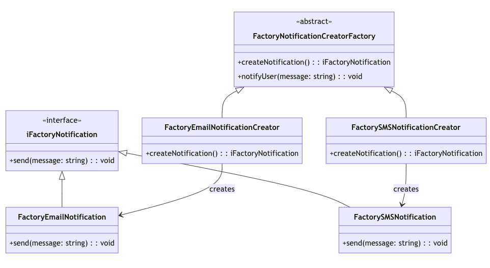
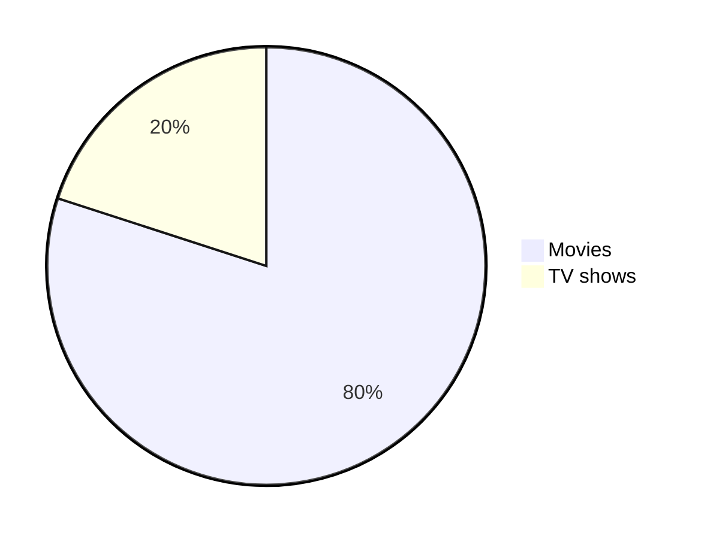
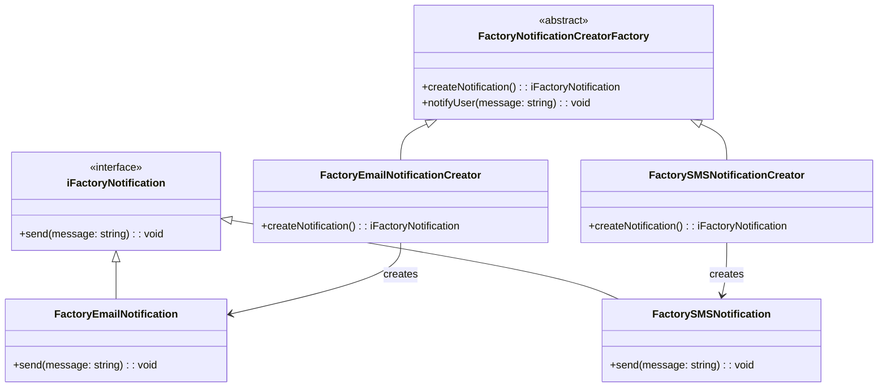

# Factory Method

## Breakdown

### Key Points

- :white_check_mark: **Creator Class:** Declares the factory method, which returns objects of the product interface type.
- :white_check_mark: **Factory Method:** Can be abstract (forcing subclasses to implement it) or have a default implementation.
- :white_check_mark: **Product Interface:** Defines the common behavior for all concrete product types.
- :white_check_mark: **Subclasses:** Implement or override the factory method to create specific product instances.

### Benefits

- :white_check_mark: **Decoupling:** Separates product creation from the main business logic.
- :white_check_mark: **Flexibility:** New product types can be introduced without modifying existing code.
- :white_check_mark: **Encapsulation:** The client code relies on the factory method rather than directly instantiating objects.

### Drawbacks

- :no_entry_sign: **You want to manage object creation centrally:** If your codebase needs to create objects that might have a variety of implementations, but you want to centralize their creation logic, the Factory Method allows you to do this without altering client code.
- :no_entry_sign: **You want to allow for future changes:** If you're designing a system that might need to handle new types of objects in the future, the Factory Method gives you the flexibility to introduce those changes without modifying existing client code.
- :no_entry_sign: **You want to reduce complexity:** The Factory Method provides a way to isolate the complex logic of creating objects in one place, making your client code cleaner and easier to maintain.

## Class Architecture

### Architecture Diagram

<p align="center">
  
  

</p>

### Architecture Snippet

[Mermaid Live Editor](https://mermaid.live/)





## Code - Snippet

```ts
/**
 * Interface for Factory Notification.
 * Defines a method for sending notifications.
 * 
 * @interface
 */
interface iFactoryNotification {
  /**
   * Sends a notification with the given message.
   * 
   * @param message - The message to be sent.
   */
  send(message: string): void;
}

/**
 * Abstract Factory for creating notifications.
 * Provides a method to create a notification and send messages.
 * 
 * @abstract
 * @class
 */
abstract class FactoryNotificationCreatorFactory {
  /**
   * Factory method to create a notification instance.
   * 
   * @returns {iFactoryNotification} - A notification instance.
   */
  abstract createNotification(): iFactoryNotification;

  /**
   * Sends a notification using the created notification instance.
   * 
   * @param message - The message to send.
   */
  notifyUser(message: string): void {
    const notification = this.createNotification();
    notification.send(message);
  }
}

/**
 * Concrete implementation of an Email Notification.
 * 
 * @class
 * @implements {iFactoryNotification}
 */
class FactoryEmailNotification implements iFactoryNotification {
  /**
   * Sends an email notification with the given message.
   * 
   * @param message - The message to be sent.
   */
  send(message: string): void {
    console.log(`Sending email: ${message}`);
  }
}

/**
 * Concrete Creator for Email Notifications.
 * Implements the factory method to create email notifications.
 * 
 * @class
 * @extends {FactoryNotificationCreatorFactory}
 */
class FactoryEmailNotificationCreator extends FactoryNotificationCreatorFactory {
  /**
   * Creates an instance of an email notification.
   * 
   * @returns {iFactoryNotification} - A new instance of FactoryEmailNotification.
   */
  createNotification(): iFactoryNotification {
    return new FactoryEmailNotification();
  }
}

/**
 * Concrete implementation of an SMS Notification.
 * 
 * @class
 * @implements {iFactoryNotification}
 */
class FactorySMSNotification implements iFactoryNotification {
  /**
   * Sends an SMS notification with the given message.
   * 
   * @param message - The message to be sent.
   */
  send(message: string): void {
    console.log(`Sending SMS: ${message}`);
  }
}

/**
 * Concrete Creator for SMS Notifications.
 * Implements the factory method to create SMS notifications.
 * 
 * @class
 * @extends {FactoryNotificationCreatorFactory}
 */
class FactorySMSNotificationCreator extends FactoryNotificationCreatorFactory {
  /**
   * Creates an instance of an SMS notification.
   * 
   * @returns {iFactoryNotification} - A new instance of FactorySMSNotification.
   */
  createNotification(): iFactoryNotification {
    return new FactorySMSNotification();
  }
}

(() => {
  const emailCreator = new FactoryEmailNotificationCreator();
  emailCreator.notifyUser("Your order has been shipped!");

  const smsCreator = new FactorySMSNotificationCreator();
  smsCreator.notifyUser("Your package will be delivered today.");
})();
```

## Test

```bash
npm i --verbose
npx mocha --fgrep 'Factory Method Test'
```