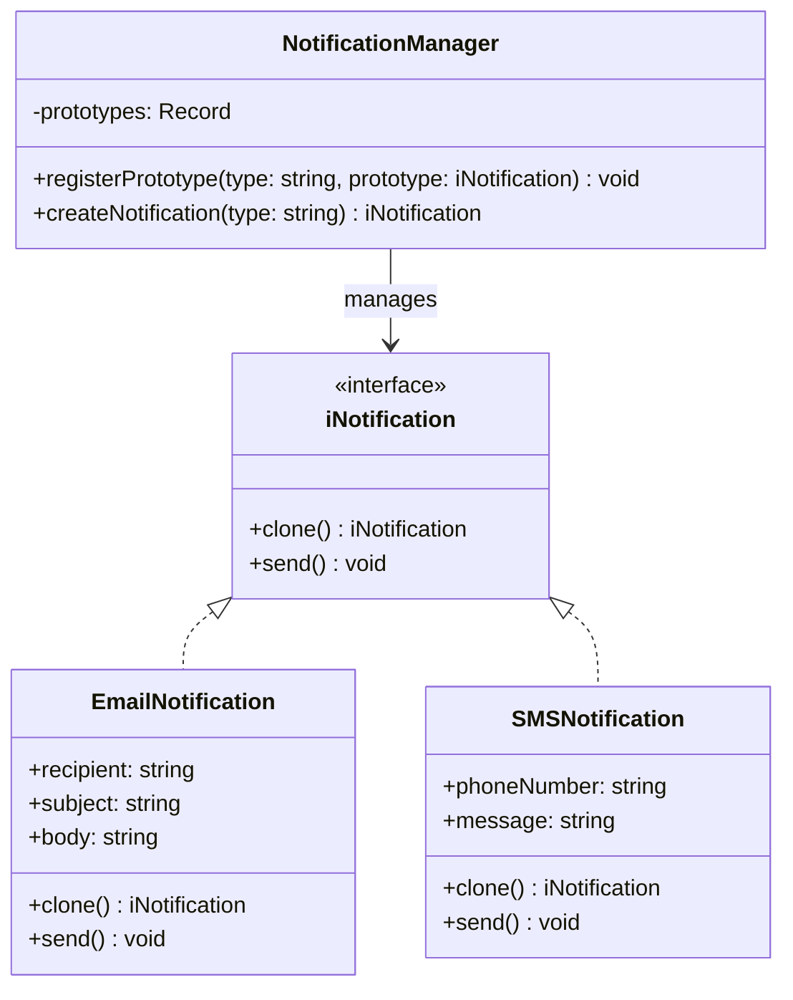

# Prototype

#### File Structure

```bash
📦 src/prototype
 ┣ 📜 prototype.ts
 ┣ 📜 README.md
📦 test/prototype
 ┣ 📜 prototype.test.ts
```

#### Test

```bash
npm run test:prototype
```

## Breakdown

### Key Points
- :white_check_mark: Uses a `clone()` method to duplicate objects.
- :white_check_mark: Avoids repetitive instantiation logic.
- :white_check_mark: Works well with objects that have many configurations.
- :white_check_mark: Helps maintain performance by reducing creation overhead.

### Benefits
- :white_check_mark: **Performance Boost** – Cloning is faster than re-instantiating complex objects.
- :white_check_mark: **Simplifies Object Creation** – Reduces dependency on constructors.
- :white_check_mark: **Preserves Object State** – Ensures consistency across instances.
- :white_check_mark: **Encourages Loose Coupling** – Reduces reliance on specific classes.

### Drawbacks

- :no_entry_sign: **Complexity in Cloning** – Deep copying can be tricky, especially with nested objects.
- :no_entry_sign: **Requires careful handling of references to avoid unintended sharing.**
- :no_entry_sign: If object structure changes, clone() logic must be updated.
- :no_entry_sign: More effort is needed to ensure correct copying behavior.
- :no_entry_sign: Cloning can obscure dependencies, making debugging harder.
- :no_entry_sign: Developers might overlook what gets copied versus referenced.
- :no_entry_sign: Cloning large objects can lead to unnecessary memory usage.
- :no_entry_sign: Risk of creating excessive objects if not managed properly.
- :no_entry_sign: If object creation is cheap, the pattern adds unnecessary complexity.
- :no_entry_sign: In some cases, a factory or constructor is a simpler alternative


## Example

### Class Architecture



### Code - Snippet

```typescript
/**
 * Prototype Interface
 * 
 * @interface
 */
interface iNotification {
  clone(): iNotification;
  send(): void;
}

/**
 * Email Notification
 * 
 * @class
 * @implements {iNotification}
 */
class EmailNotification implements iNotification {
  /**
   * 
   * @param {string} recipient 
   * @param {string} subject 
   * @param {string} body 
   */
  constructor(
    public recipient: string,
    public subject: string,
    public body: string,
  ) { }

  /**
   * Clone the email notification
   * 
   * @returns {iNotification}
   */
  clone(): iNotification {
    return new EmailNotification(this.recipient, this.subject, this.body);
  }

  /**
   * Send the email notification
   * 
   * @returns {void}
   */
  send(): void {
    console.log(`Sending email to ${this.recipient} with subject ${this.subject} and body ${this.body}`);
  }

}

/**
 * SMS Notification
 * 
 * @class
 * @implements {iNotification}
 */
class SMSNotification implements iNotification {
  /**
   * 
   * @param {string} phoneNumber 
   * @param {string} message 
   */
  constructor(
    public phoneNumber: string,
    public message: string
  ) { }

  /**
   * Clone the SMS notification
   * 
   * @returns {iNotification}
   */
  clone(): iNotification {
    return new SMSNotification(this.phoneNumber, this.message);
  }

  /**
   * Send the SMS notification
   * 
   * @returns {void}
   */
  send(): void {
    console.log(`Sending SMS to ${this.phoneNumber}: ${this.message}`);
  }
}

/**
 * Notification Manager
 * 
 * @class
 */
class NotificationManager {
  /**
   * Prototypes
   * 
   * @type {Record<string, iNotification>}
   */
  private prototypes: { [key: string]: iNotification } = {};

  /**
   * Register a prototype
   * 
   * @param {string} type 
   * @param {iNotification} prototype 
   * @returns {void}
   */
  registerPrototype(type: string, prototype: iNotification): void {
    this.prototypes[type] = prototype;
  }

  /**
   * Create a notification
   * 
   * @param {string} type 
   * @returns {iNotification}
   */
  createNotification(type: string): iNotification {
    return this.prototypes[type].clone();
  }
}

(() => {
  // Step 4: Demonstration
  const manager = new NotificationManager();

  // Register prototypes
  manager.registerPrototype('email', new EmailNotification('user@example.com', 'Welcome', 'Thanks for signing up!'));
  manager.registerPrototype('sms', new SMSNotification('+1234567890', 'Your OTP is 1234'));

  console.log('do we get here');
  // Clone and send notifications
  const emailClone = manager.createNotification('email');
  emailClone.send(); // Output: Sending Email to user@example.com: Welcome - Thanks for signing up!

  const smsClone = manager.createNotification('sms');
  smsClone.send(); // Output: Sending SMS to +1234567890: Your OTP is 1234
})();
```