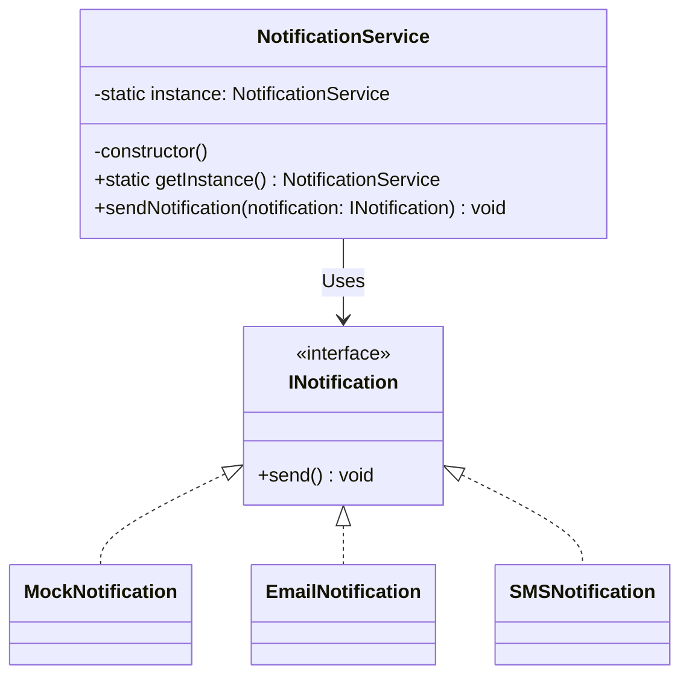

# Singleton

#### File Structure

```bash
📦 src/singleton
 ┣ 📜 singleton.ts
 ┣ 📜 README.md
📦 test/singleton
 ┣ 📜 singleton.test.ts
```

#### Test

```bash
npm run test:singleton
```

## Breakdown

### Key Points

- :white_check_mark: Guarantees that only one instance of a class exists.
- :white_check_mark: Provides a single point of access (usually through a static method).
- :white_check_mark: Often implemented using lazy initialization (instance created only when needed).
- :white_check_mark: Useful for managing shared resources, such as database connections, logging systems, or configuration settings.

## Benefits

- :white_check_mark: **Controlled Access** – Prevents multiple instances from being created accidentally.
- :white_check_mark: **Efficient Resource Management** – Saves memory and improves performance by sharing resources.
- :white_check_mark: **Thread-Safe (if implemented correctly)** – Avoids race conditions in multi-threaded environments.
- :white_check_mark: **Global Access Point** – Ensures that different parts of an application use the same instance.

## Drawbacks

- :no_entry_sign: **Tight Coupling** – Since the instance is globally accessible, classes depending on the singleton become tightly coupled to it, reducing flexibility.
- :no_entry_sign: **Difficult to Test** – Singleton objects introduce global state, making unit tests less predictable and harder to isolate.
- :no_entry_sign: **Hidden Dependencies** – Since singletons are accessible anywhere, they hide dependencies, making it harder to track where changes affect the system.
- :no_entry_sign: **Concurrency Issues** – In multi-threaded environments, improper implementation can lead to race conditions or performance bottlenecks.
- :no_entry_sign: **Harder to Scale** – If an application grows beyond a single-machine setup, a singleton might not work well in a distributed system.
- :no_entry_sign: **Inflexibility** – Once a singleton is implemented, changing or extending its behavior can be complex without modifying multiple parts of the application.

## Example

### Class Architecture



### Code - Snippet

```typescript
interface INotification {
  send(): void;
}

/**
 * Notification Service
 * 
 * @class NotificationService
 * @description A singleton class for sending notifications
 */
export class NotificationService {
  /**
   * Instance
   * 
   * @private
   * @static
   * @type {NotificationService}
   */
  private static instance: NotificationService;

  /**
   * Constructor
   * 
   * @private
   */
  private constructor() {
    console.log('NotificationService initialized');
  }

  /**
   * Get Instance
   * 
   * @static
   * @returns {NotificationService}
   */
  static getInstance(): NotificationService {
    if (!NotificationService.instance) {
      NotificationService.instance = new NotificationService();
    }
    return NotificationService.instance;
  }

  /**
   * Send Notification
   * 
   * @param {Notification} notification
   */
  sendNotification(notification: INotification): void {
    notification.send();
  }
}

(() => {
  // Step 5: Using the Singleton
  const notificationService1 = NotificationService.getInstance();
  const notificationService2 = NotificationService.getInstance();
})();
```